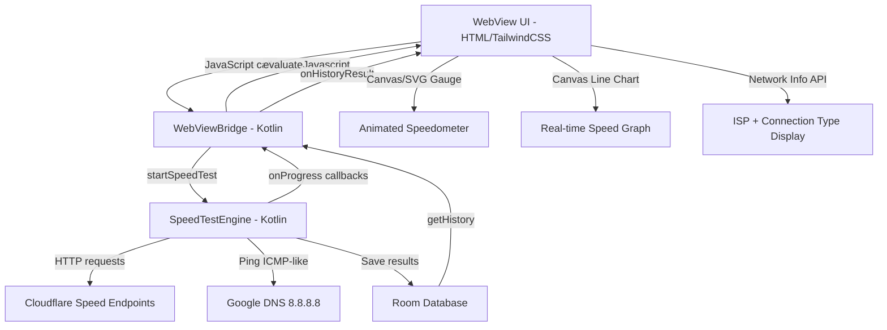

# Speedtest.net-Like Features Implementation Plan

## Project Overview

**NetSpeed Meter** is an Android app that monitors network speed and data usage. It uses a **WebView-based UI** (HTML/TailwindCSS in assets) with a liquid glassmorphic design, connected to native Android via [`WebViewBridge`](stitch_netspeed_performance_monitor/app/src/main/java/com/netspeedmeter/engine/WebViewBridge.kt). The current [`SpeedTestEngine`](stitch_netspeed_performance_monitor/app/src/main/java/com/netspeedmeter/engine/SpeedTestEngine.kt) has placeholder/fallback logic and the UI lacks the animated gauge and real-time graph that speedtest.net provides.

---

## Feature Comparison: Current vs Speedtest.net

| Feature | Current State | Speedtest.net Target |
|---------|--------------|---------------------|
| Speed Gauge | Static circular meter with `--` placeholders | Animated SVG/Canvas speedometer with real-time needle |
| Speed Test | Placeholder URLs, fallback simulated data | Real HTTP download/upload with progress tracking |
| Test Stages | No visible stage progression | Ping → Download → Upload with animated transitions |
| Real-time Graph | None | Live waveform/line graph during test |
| Server Info | None | ISP name, server location, IP address |
| Jitter/Packet Loss | Not measured | Jitter ms and packet loss % |
| Connection Type | Basic mobile/WiFi detection | WiFi/4G/5G with icon display |
| Result Sharing | None | Share via link or screenshot |
| History | Static list | Chart-based comparison over time |

---

## Architecture Diagram

---

## Implementation Steps

### Phase 1: Real Speed Test Engine

#### 1.1 Replace placeholder test server with real endpoints
- **File**: [`SpeedTestEngine`](stitch_netspeed_performance_monitor/app/src/main/java/com/netspeedmeter/engine/SpeedTestEngine.kt)
- Replace `TEST_SERVER_URL = "https://speedtest.net"` with Cloudflare speed test endpoint: `https://speed.cloudflare.com/__down?bytes=10000000` for download and `https://speed.cloudflare.com/__up` for upload
- These are free, public endpoints that actually serve bytes for testing

#### 1.2 Implement proper download speed measurement
- Download real data from Cloudflare endpoint in chunks
- Measure bytes received over time with multiple samples
- Calculate average and peak speeds
- Report progress via `onProgress` callback with real percentage

#### 1.3 Implement proper upload speed measurement  
- Upload real data to Cloudflare endpoint
- Measure bytes sent over time
- Calculate average and peak speeds

#### 1.4 Add jitter and packet loss measurement
- Send 10+ ping samples instead of current 5
- Calculate jitter as standard deviation of ping times
- Calculate packet loss as failed connections / total attempts
- Add these fields to [`SpeedTestResult`](stitch_netspeed_performance_monitor/app/src/main/java/com/netspeedmeter/engine/SpeedTestEngine.kt:30) data class

#### 1.5 Update database entity for new fields
- **File**: [`SpeedTestHistoryEntity`](stitch_netspeed_performance_monitor/app/src/main/java/com/netspeedmeter/database/entity/SpeedTestHistoryEntity.kt) - Add `jitter` and `packetLoss` columns
- **File**: [`AppDatabase`](stitch_netspeed_performance_monitor/app/src/main/java/com/netspeedmeter/database/AppDatabase.kt) - Increment version to 2, add migration
- **File**: [`AppDao`](stitch_netspeed_performance_monitor/app/src/main/java/com/netspeedmeter/database/dao/AppDao.kt) - Update queries if needed

#### 1.6 Add network info detection
- Create new `NetworkInfoProvider` utility class
- Detect ISP name from connection metadata
- Detect connection type: WiFi, 4G, 5G, 3G, etc.
- Get external IP via public API like `https://api.ipify.org`
- Get approximate location from IP via `https://ipapi.co/json/`

#### 1.7 Add progress callback with stage details
- Update `startTest` to emit granular progress: stage name, progress percent, current speed
- Add `onStageChange` callback for Ping → Download → Upload transitions
- Update [`WebViewBridge.startSpeedTest()`](stitch_netspeed_performance_monitor/app/src/main/java/com/netspeedmeter/engine/WebViewBridge.kt:38) to push progress updates to WebView

---

### Phase 2: Animated Speed Gauge UI

#### 2.1 Create SVG-based animated speedometer
- **File**: `stitch_netspeed_performance_monitor/app/src/main/assets/area_test.html`
- Replace the static liquid-shape meter with an SVG speedometer gauge
- Gauge should have: tick marks, speed labels on arc, animated needle
- Needle rotates smoothly based on current speed value
- Arc fills with color gradient as speed increases
- Max speed scale: 0-100 Mbps default, auto-adjusts to 0-500 or 0-1000

#### 2.2 Add real-time speed graph during test
- Add a Canvas-based line chart below the gauge
- Shows speed over time as a waveform during download/upload phases
- X-axis: time in seconds, Y-axis: speed in Mbps
- Line color matches primary/tertiary theme colors
- Graph clears and resets between stages

#### 2.3 Add stage transition animations
- When test moves from Ping → Download → Upload:
  - Gauge label changes with fade animation
  - Progress ring around gauge fills incrementally
  - Stage indicator dots light up sequentially

#### 2.4 Add network info display panel
- Below the gauge, show: ISP name, server location, connection type icon
- Show external IP address
- Show connection type with appropriate icon: WiFi, 4G, 5G

---

### Phase 3: Enhanced Results & History

#### 3.1 Update results display on area_test.html
- After test completes, show detailed results card:
  - Download speed with grade rating: Excellent/Good/Fair/Poor
  - Upload speed with grade rating
  - Ping with jitter value
  - Packet loss percentage
  - Connection type and ISP

#### 3.2 Add result sharing functionality
- Add `shareResult()` method to WebViewBridge
- Generate a result summary image or text
- Use Android `Intent.ACTION_SEND` to share
- Add share button in results UI

#### 3.3 Enhance history page with charts
- **File**: `stitch_netspeed_performance_monitor/app/src/main/assets/history.html`
- Add a simple line chart showing speed trends over time
- Use Canvas-based chart library or simple SVG chart
- Show download/upload/ping trends separately
- Add filter by: Day/Week/Month with actual data queries

#### 3.4 Add comparison feature
- Show average speeds vs current test result
- Highlight if current result is above/below average

---

### Phase 4: WebViewBridge & JS Integration

#### 4.1 Add new JavaScript interface methods
- **File**: [`WebViewBridge`](stitch_netspeed_performance_monitor/app/src/main/java/com/netspeedmeter/engine/WebViewBridge.kt)
- Add `getNetworkInfo()` - returns ISP, IP, connection type
- Add `shareResult(json)` - triggers Android share intent
- Add `getServerList()` - returns available test servers
- Update `startSpeedTest()` to push progress updates via `evaluateJavascript`

#### 4.2 Add JavaScript event handlers in HTML
- `window.onSpeedTestProgress(stage, progress, currentSpeed)` - real-time gauge update
- `window.onSpeedTestResult(result)` - final result display
- `window.onNetworkInfo(info)` - display ISP/IP/connection
- `window.onStageChange(stage)` - transition animations

#### 4.3 Wire up the Start Test button
- Connect the existing Start Test button in area_test.html to `Android.startSpeedTest()`
- Disable button during test, show cancel option
- Show test duration timer

---

### Phase 5: Polish & Optimization

#### 5.1 Add test server selection
- Create a list of 3-5 public speed test endpoints:
  - Cloudflare: `speed.cloudflare.com`
  - Fast.com style Netflix endpoint
  - Custom fallback server
- Let user select preferred server in Settings page

#### 5.2 Add cancel test functionality
- Add `cancelSpeedTest()` to SpeedTestEngine and WebViewBridge
- Cancel ongoing OkHttp calls
- Reset gauge to idle state

#### 5.3 Optimize test accuracy
- Use multiple parallel connections for download test
- Discard first 1-2 seconds as warmup
- Calculate weighted average favoring sustained speed
- Add minimum test duration of 5 seconds per stage

#### 5.4 Add settings for test configuration
- Test duration preference: Quick/Standard/Extended
- Server selection
- Auto-test schedule

---

## Files to Modify/Create

### Modify Existing Files
| File | Changes |
|------|---------|
| [`SpeedTestEngine.kt`](stitch_netspeed_performance_monitor/app/src/main/java/com/netspeedmeter/engine/SpeedTestEngine.kt) | Real endpoints, jitter/packet loss, granular progress |
| [`WebViewBridge.kt`](stitch_netspeed_performance_monitor/app/src/main/java/com/netspeedmeter/engine/WebViewBridge.kt) | New JS methods: getNetworkInfo, shareResult, progress push |
| [`SpeedTestHistoryEntity.kt`](stitch_netspeed_performance_monitor/app/src/main/java/com/netspeedmeter/database/entity/SpeedTestHistoryEntity.kt) | Add jitter, packetLoss columns |
| [`AppDatabase.kt`](stitch_netspeed_performance_monitor/app/src/main/java/com/netspeedmeter/database/AppDatabase.kt) | Version 2, migration |
| [`AppDao.kt`](stitch_netspeed_performance_monitor/app/src/main/java/com/netspeedmeter/database/dao/AppDao.kt) | Updated queries |
| [`area_test.html`](stitch_netspeed_performance_monitor/app/src/main/assets/area_test.html) | Animated gauge, speed graph, stage transitions, network info |
| [`history.html`](stitch_netspeed_performance_monitor/app/src/main/assets/history.html) | Charts, filters, comparison |
| [`home.html`](stitch_netspeed_performance_monitor/app/src/main/assets/home.html) | Network info display, quick test button |
| [`MainActivity.kt`](stitch_netspeed_performance_monitor/app/src/main/java/com/netspeedmeter/MainActivity.kt) | Add share intent handler |

### Create New Files
| File | Purpose |
|------|---------|
| `NetworkInfoProvider.kt` | ISP detection, IP lookup, connection type |
| `SpeedTestProgress.kt` | Progress data class with stage/speed/percent |
| `settings.html` | Settings page with server selection, test config |

---

## Key Design Decisions

1. **Cloudflare endpoints** for real speed testing - free, public, no API key needed
2. **SVG gauge** instead of static liquid shapes - enables smooth needle animation
3. **Canvas line chart** for real-time graph - better performance than SVG for streaming data
4. **Room migration** instead of destructive migration - preserves user history
5. **Keep liquid glassmorphic theme** - maintain existing design language while adding functionality

---

## Risk Considerations

- **Cloudflare endpoints may change** - need fallback logic
- **Some networks block speed test endpoints** - keep simulated fallback
- **Room migration must be tested** - data loss risk if migration fails
- **WebView performance** - Canvas animations must be optimized for mobile WebView
- **Battery impact** - real download/upload tests consume data and battery